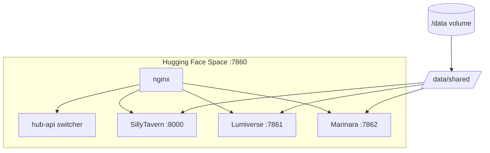

# AI Frontends Hub

Deploy **SillyTavern**, **Lumiverse**, and **Marinara Engine** on a single [Hugging Face Space](https://huggingface.co/spaces) (free tier friendly), with a shared data library under `/data`.

| Frontend | Repo |
|----------|------|
| SillyTavern | https://github.com/SillyTavern/SillyTavern |
| Lumiverse | https://github.com/prolix-oc/Lumiverse |
| Marinara Engine | https://github.com/Pasta-Devs/Marinara-Engine |

## Can we actually do this?

**Yes, with realistic expectations:**

| Goal | Status |
|------|--------|
| All 3 UIs on one HF Space | ✅ App switcher (one active at a time) |
| Persistent `/data` volume | ✅ Mount HF storage bucket at `/data` |
| Shared characters | ✅ Live in SillyTavern; synced to others |
| Shared lorebooks | ✅ Same pattern via `world_info` |
| Shared API connections | ⚠️ Partial — each app stores connections differently; export/import JSON to `/data/shared/connections` |

HF free Spaces expose **one port (7860)** and have **16 GB RAM**. Running three Node/Bun servers at once is tight, so this hub runs **one frontend at a time** and lets you switch from a launcher at `/hub`.

## Quick deploy on Hugging Face

1. **Create a Docker Space** at [huggingface.co/new-space](https://huggingface.co/new-space).
2. Push this repo (or copy `Dockerfile` + `docker/` + `scripts/` + `config/` + `public/`).
3. **Settings → Persistent storage** → attach a bucket mounted at **`/data`**.
4. **Settings → Variables and secrets** (recommended):

| Secret | Purpose |
|--------|---------|
| `OWNER_PASSWORD` | Lumiverse admin password (default user: `admin`) |
| `ADMIN_SECRET` | Marinara privileged APIs + auto ST import sync |
| `BASIC_AUTH_USER` / `BASIC_AUTH_PASS` | Optional HTTP auth in front of everything |

5. Wait for the build (~10–15 min first time), then open the Space URL.
6. Visit **`/hub`** to pick SillyTavern, Lumiverse, or Marinara.

## Shared data layout

```
/data/
├── shared/                    # Canonical library (put files here)
│   ├── characters/            # SillyTavern PNG/JSON character cards
│   ├── world_info/            # Lorebooks (ST world JSON files)
│   └── connections/           # Optional neutral JSON exports
├── sillytavern/               # ST config + per-user data
├── lumiverse/                 # Lumiverse SQLite + identity
├── marinara/                  # Marinara file-native storage
└── .active_app                # Last selected frontend
```

### How sharing works

- **SillyTavern** symlinks `characters` and `worlds` directly to `/data/shared/*` — changes are immediate.
- **Marinara** reads `/data/shared` via `IMPORT_ALLOWED_ROOTS` and periodic sync into import staging. Use **Settings → Import → SillyTavern bulk import** (or set `ADMIN_SECRET` for automatic scan).
- **Lumiverse** receives synced cards in `import-staging/`; import them via the Lumiverse UI (character import supports V1/V2/V3 cards).

> **Connections** (OpenRouter, OpenAI, etc.) are **not** automatically mirrored across apps today — each frontend encrypts and stores them in its own schema. Store reusable connection JSON in `/data/shared/connections/` and import per app, or configure once per frontend.

## Switching frontends

- Launcher: `https://<your-space>.hf.space/hub`
- API: `GET /api/switch/sillytavern` | `lumiverse` | `marinara`
- Active app root: `https://<your-space>.hf.space/`

## Local test

```bash
docker build -t ai-frontends-hub .
docker run --rm -it -p 7860:7860 -v "$(pwd)/data:/data" \
  -e OWNER_PASSWORD=changeme \
  ai-frontends-hub
```

Open http://localhost:7860/hub

## Architecture



## Build args

| Arg | Default | Description |
|-----|---------|-------------|
| `LUMIVERSE_REF` | `main` | Git branch/tag for Lumiverse |

## Limitations

- **One UI at a time** — not three simultaneous tabs on different frontends.
- **First build is slow** — pulls ST + Marinara (`:latest`) images and compiles Lumiverse.
- **Free tier sleep** — Space sleeps after 48h idle; `/data` persists via storage bucket.
- **True live sync of connections** — not built-in; characters/lorebooks are the focus.

## License

Hub orchestration scripts: MIT. Each frontend retains its own license (SillyTavern, Lumiverse Community License, Marinara AGPL-3.0).