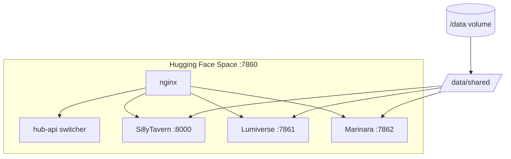

# AI Frontends Hub

Deploy **SillyTavern**, **Lumiverse**, and **Marinara Engine** on a single [Hugging Face Space](https://huggingface.co/spaces) (free tier friendly), with a shared data library under `/data`.

| Frontend | Repo |
|----------|------|
| SillyTavern | https://github.com/SillyTavern/SillyTavern |
| Lumiverse | https://github.com/prolix-oc/Lumiverse |
| Marinara Engine | https://github.com/Pasta-Devs/Marinara-Engine |

## Can we actually do this?

**Yes, with realistic expectations:**

| Goal | Status |
|------|--------|
| All 3 UIs on one HF Space | ✅ App switcher (one active at a time) |
| Persistent `/data` volume | ✅ Mount HF storage bucket at `/data` |
| Shared characters | ✅ Live in SillyTavern; synced to others |
| Shared lorebooks | ✅ Same pattern via `world_info` |
| Shared API connections | ⚠️ Partial — each app stores connections differently; export/import JSON to `/data/shared/connections` |

HF free Spaces expose **one port (7860)** and have **16 GB RAM**. Running three Node/Bun servers at once is tight, so this hub runs **one frontend at a time** and lets you switch from a launcher at `/hub`.

## Deploy on Hugging Face

**Repo:** https://github.com/Sexlovr/ai-hub-frontend

### Option A — Import from GitHub (recommended)

1. [huggingface.co/new-space](https://huggingface.co/new-space) → **Docker** SDK
2. **Import from GitHub** → `Sexlovr/ai-hub-frontend`
3. Create Space → wait for build (~10–15 min)

### Option B — Paste Dockerfile only

The Dockerfile is **self-contained** — it clones hub scripts from GitHub at build time. You only need **two files** in the Space:

1. `Dockerfile` (from this repo)
2. `README.md` (this file, including the `---` yaml block at the top)

Do **not** paste only the Dockerfile without `README.md` — HF needs the yaml frontmatter (`sdk: docker`, `app_port: 7860`).

### After create (both options)

1. **Settings → Persistent storage** → mount bucket at **`/data`**
2. **Settings → Secrets** (optional but recommended):
   - `OWNER_PASSWORD` — Lumiverse first-time setup (user `admin`)
   - `PUBLIC_ORIGIN` — `https://your-space.hf.space` (auto-detected from `SPACE_HOST` when omitted)
3. Open Space URL → visit **`/api/hub`** to switch frontends

### `/hub` shows React 404 or Lumiverse login fails?

| Symptom | Cause | Fix |
|---------|-------|-----|
| React **404 Not Found** at `/hub` | Lumiverse’s **PWA service worker** serves its cached SPA for `/hub` after first visit | Use **`/api/hub`** or **`/hub.html`** (not bare `/hub`); hub page auto-clears the PWA cache. Incognito worked because it had no service worker. |
| Lumiverse **sign-in error** | BetterAuth `baseURL` was `http://localhost:7861` | Rebuild; set `PUBLIC_ORIGIN` secret if auto-detect fails; check Logs for `[lumiverse] AUTH_BASE_URL=https://…` |

**Quick switch links** (work even when the launcher page doesn’t):

- SillyTavern: `/api/switch/sillytavern` (first launch can take **1–3 minutes** — wait on the “Switching…” page)

### SillyTavern shows “settings couldn't be loaded”?

| Symptom | Cause | Fix |
|---------|-------|-----|
| UI stuck on **Initializing**, then settings error | `/data/sillytavern/data/default-user/settings.json` was never seeded | **Factory rebuild** after pulling latest hub; init script seeds `settings.json` + preset folders on boot |
| `/api/settings/get` returns **500** | Same — missing `settings.json` or preset directories | Rebuild; or delete `/data/sillytavern/data/default-user/content.log` and restart so defaults re-copy |

No SillyTavern fork is required — this is user-data seeding, not a missing npm package.
- Lumiverse: `/api/switch/lumiverse`
- Marinara: `/api/switch/marinara`

### Space got Paused instantly (no logs)?

HF runs Docker Spaces as **UID 1000** (non-root). The old image used root + supervisord + nginx system mode → container died before any log appeared.

**Current fix:** runs as `user` (uid 1000), lightweight build (no Lumiverse compile at build time), nginx on `/tmp` paths.

| Cause | Fix |
|-------|-----|
| Instant pause, empty logs | Pull latest repo & **Factory rebuild** |
| Build failed | Check **Logs** tab after rebuild |
| Storage limit exceeded | Delete Space, recreate fresh |
| Only pasted Dockerfile | Also need `README.md` with `sdk: docker` yaml |
| Lumiverse first open slow | Normal — builds on first switch into `/data` |

After rebuild you should immediately see `[hub] HF start ...` in Logs.

## Shared data layout

```
/data/
├── shared/                    # Canonical library (put files here)
│   ├── characters/            # SillyTavern PNG/JSON character cards
│   ├── world_info/            # Lorebooks (ST world JSON files)
│   └── connections/           # Optional neutral JSON exports
├── sillytavern/               # ST config + per-user data
├── lumiverse/                 # Lumiverse SQLite + identity
├── marinara/                  # Marinara file-native storage
└── .active_app                # Last selected frontend
```

### How sharing works

| Layer | What happens |
|-------|----------------|
| **Canonical store** | `/data/shared/characters` (PNG/JSON cards), `/data/shared/world_info` (lorebooks) |
| **SillyTavern** | Symlinks `characters` + `worlds` → shared — **writes here directly** |
| **Marinara** | Hub sync uses **one canonical PNG per character** (`hub_marinara_{name}.png`). Never re-imports its own exports. |
| **Lumiverse** | Same canonical pattern (`hub_lumiverse_{name}.png`). Auto-import/export needs `OWNER_PASSWORD` in HF Secrets (must match your Lumiverse login password; username is read from `owner.credentials`). |
| **SillyTavern** | Own `characters/` folder (not symlinked). Sync copies `hub_*` cards in/out to avoid duplicate explosions. |

**No custom translator is required for standard cards.** All three apps use the same industry formats (Tavern Card V1/V2/V3 in PNG `chara`/`ccv3` chunks or JSON). Marinara and Lumiverse already convert those into their own internal schemas on import.

Trigger a sync manually: `GET /api/sync`

> **Connections** (OpenRouter, OpenAI, etc.) are **not** automatically mirrored — each app encrypts/stores them differently. Put exports in `/data/shared/connections/` and import per app.

### Character not showing in another frontend?

1. Confirm the PNG exists in `/data/shared/characters/` (SillyTavern writes here directly; Marinara/Lumiverse export here on sync).
2. **Switch to the target app** (or wait for the 5‑minute background sync) — export runs from the app you're leaving; import runs in the app that is up.
3. Hit **`/api/sync`** then refresh the character list.
4. For **Lumiverse auto-import**, set `OWNER_PASSWORD` in HF Secrets to your **actual Lumiverse login password** (username is auto-read from `/data/lumiverse/owner.credentials` — do not set a wrong `OWNER_USERNAME`).
5. **Shortcuts:** `/sillytavern`, `/lumiverse`, `/marinara` switch the active UI (one app at a time — required on HF free tier).

## Switching frontends

- Launcher: `https://<your-space>.hf.space/api/hub` (or `/hub.html`)
- API: `GET /api/switch/sillytavern` | `lumiverse` | `marinara`
- Active app root: `https://<your-space>.hf.space/`

## Local test

```bash
docker build -t ai-frontends-hub .
docker run --rm -it -p 7860:7860 -v "$(pwd)/data:/data" \
  -e OWNER_PASSWORD=changeme \
  ai-frontends-hub
```

Open http://localhost:7860/hub

## Architecture



## Build args

| Arg | Default | Description |
|-----|---------|-------------|
| `LUMIVERSE_REF` | `main` | Git branch/tag for Lumiverse |

## Limitations

- **One UI at a time** — not three simultaneous tabs on different frontends.
- **First build is slow** — pulls ST + Marinara (`:latest`) images and compiles Lumiverse.
- **Free tier sleep** — Space sleeps after 48h idle; `/data` persists via storage bucket.
- **True live sync of connections** — not built-in; characters/lorebooks are the focus.

## License

Hub orchestration scripts: MIT. Each frontend retains its own license (SillyTavern, Lumiverse Community License, Marinara AGPL-3.0).